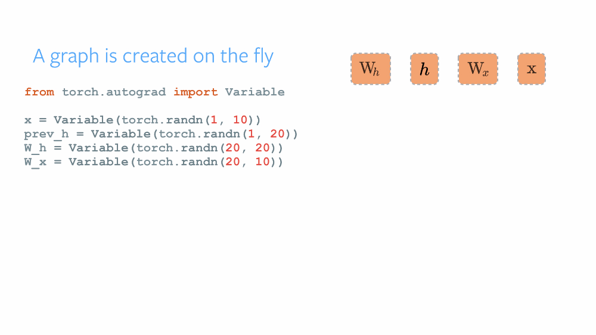

# Reddit Hyperlink Conflict Detection implementation with PyCUDA
## Data
* Information about subreddit embedding and user embedding can be found at this [link](http://snap.stanford.edu/conflict/)
* Information about hyperlink data can be found at this [link](https://snap.stanford.edu/data/soc-RedditHyperlinks.html)

## About this project
* This project implement the paper [Community Interaction and Conflict on the Web](https://cs.stanford.edu/~srijan/pubs/conflict-paper-www18.pdf) by using PyCuda
* The model architecture `Social Primed LSTM`

* In this project, tensor is reimplemented with PyCuda, Scikit-cuda. Gradient of tensor is based on [Dynamic Computaional Graph](https://medium.com/intuitionmachine/pytorch-dynamic-computational-graphs-and-modular-deep-learning-7e7f89f18d1)

* The implementation of `tensor` based on the book [Deep Learning Grokking](https://www.manning.com/books/grokking-deep-learning) running on GPU with Cuda instead of running on CPU (`numpy`) like this book.
 

